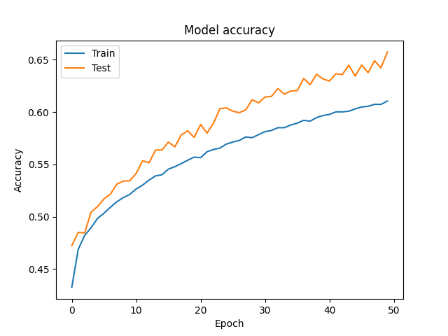
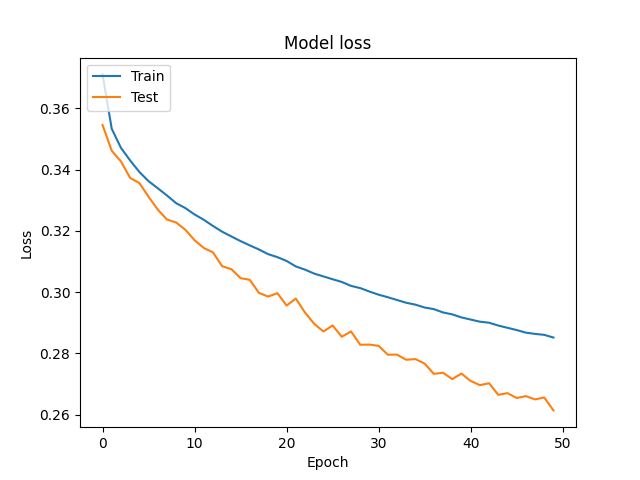
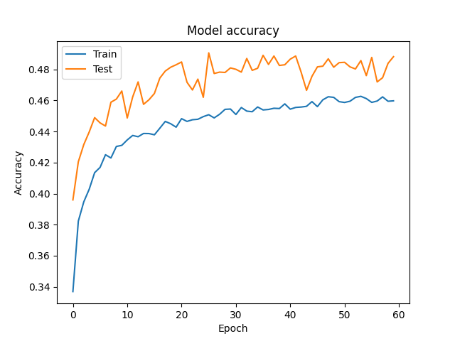
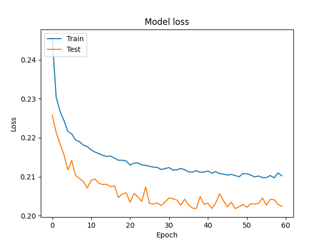
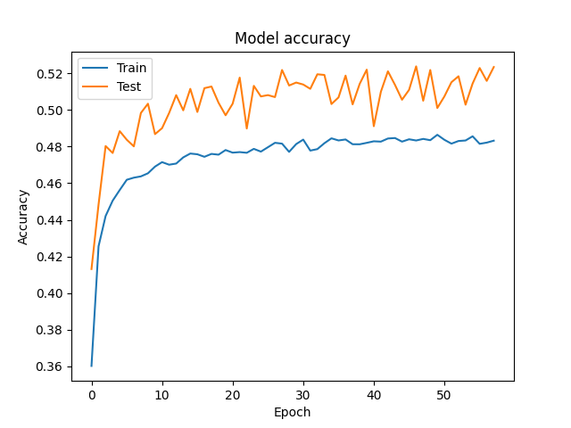
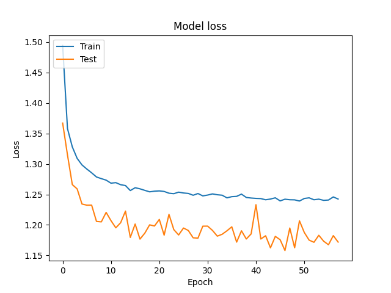
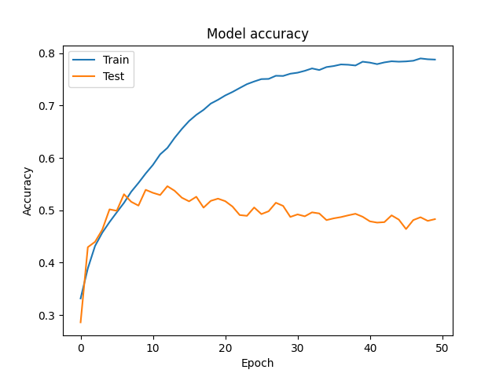
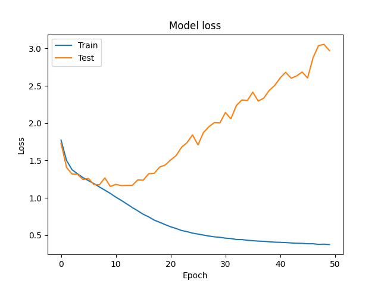

# 🐶 이게멍냥 🐱

- 진행 기간 : 2022.08.29 ~ 2022.10.07 (6주간) <br/>
- 서비스 명 : 이게멍냥

## 🐶🐱 팀원 소개

```
  SSAFY 7기_특화프로젝트 광주1반(C101) 광주 이게멍냥 팀
[ 팀원소개 ](https://www.notion.so/a6ae1807780d4a46b1eb408f3a3ddb07)
```

| AI                                                                                                                                          | AI                                                                                                                                          | AI                                                                                                                                          | Front-End                                                                                                                                   | Front-End                                                                                                                                   | Back-End                                                                                                                                    |
| ------------------------------------------------------------------------------------------------------------------------------------------- | ------------------------------------------------------------------------------------------------------------------------------------------- | ------------------------------------------------------------------------------------------------------------------------------------------- | ------------------------------------------------------------------------------------------------------------------------------------------- | ------------------------------------------------------------------------------------------------------------------------------------------- | ------------------------------------------------------------------------------------------------------------------------------------------- |
|  |  |  |  |  |  |
| 김수빈(팀장)                                                                                                                                | 김대현(팀원)                                                                                                                                | 김윤민(팀원)                                                                                                                                | 이동주(팀원)                                                                                                                                | 고요한(팀원)                                                                                                                                | 서은지(팀원)                                                                                                                                |

<br/>

## 🐶🐱 기술 스택

  
  
  
  
<br/>


  


[ 기술 스택 ](https://www.notion.so/394c6ecfd7db44fd92337e5c5b937dd1)<br>

## 🐶🐱 기획배경

- 2020년 통계청의 인구총조사에 따르면 반려동물을 기르고 있는 가구는 총 312만 가구로 전체 가구수의 약 15퍼센트를 차지하고 있으며 코로나19를 거치며 반려동물을 기르는 가구의 수는 점차 증가하고 있습니다.
- 또한 농식품부 교육문화정보원의 조사에 따르면 TV, 동영상플랫폼, SNS 등 여러 매체들의 영향으로 반려동물에 대한 건강과 복지에 대한 관심은 과거보다 훨씬 크게 높아져 펫셔리(펫+럭셔리), 펫캉스(펫+바캉스) 등 반려동물케어서비스에 대한 인식도 긍정적으로 변화하며 이용률도 증가하고 있습니다.
  이에 따라 반려동물관련 산업은 매해 꾸준히 증가하여 현재 약 4조원에 다다르며 동물병원에 대한 수요도 증가하여 2019년 대비 2022년에는 약 2배 가량 동물병원 방문 횟수가 늘어났습니다.
- 우리 서비스는 이러한 수요헤 반응하여 Ai진단을 통한 빠르고 간편하게 반려동물들의 질병에 대해 도움을 제공하며 그 밖의 다른 기능들을 통해서 반려인들과 반려동물들의 건강과 복지의 질이 더 나아질 수 있도록 지원하고자 합니다.

[ 기획 배경 자료 ](https://www.notion.so/77447be27ed74646acf1833e5a2565d7)<br>

## 🐶🐱 프로젝트 소개

- 이게멍냥은 반려동물의 피부질환과 안구질환을 AI를 활용하여 사진분석으로 진단하는 서비스를 메인 기능으로 갖는 웹 서비스입니다. <br>
- 반려 동물의 여러 질병들에 대한 증상 별 응급 처치 케어가이드를 동영상 등을 통해 보다 자세히 제공합니다 <br>
- 이용자의 반려동물들을 자랑할 수 있으며 잃어버린 반려동물을 찾는 커뮤니티 서비스를 제공합니다 <br>
- 사용자 주변의 반려동물 관련 병원과 애완용품상점 등 반려동물 관련 시설의 위치 등 관련 정보들을 제공합니다 <br>

## 🐶🐱 UCC

- UCC 영상 주소

## 🐶🐱 시연영상

- 시연영상

## 🐶🐱 주요기능 및 페이지 구성

### **메인페이지**

```
이게멍냥의 메인페이지 입니다. 이게멍냥에서 제공하는 모든 서비스를 살펴볼 수 있습니다.
```

### **진단하기페이지**

```
이게멍냥의 진단하기페이지 입니다. 반려동물의 종류와 환부를 선택한 후 환부에 해당하는 사진을 업로드하면 관련 질병에 대한 정보를 얻을 수 있습니다.
```

### **커뮤니티페이지(자랑하기)**

```
이게멍냥의 커뮤니티페이지(자랑하기)입니다. 서비스 이용자의 반려동물들의 사진을 공유하고 댓글을 통해 서로 소통할 수 있습니다.
```

### **커뮤니티페이지(실종찾기)**

```
이게멍냥의 커뮤니티페이지(실종찾기)입니다. 실종된 동물들에 대한 정보를 카드형식으로 서로 공유하여 실종된 반려동물을 찾는데 도움을 제공합니다.
```

### **응급처치페이지**

```
이게멍냥의 응급처치페이지입니다. 반려동물들을 기르면서 발생하는 각종 사고에 대한 대처를 동영상과 함께 제공합니다.
```

### **주변시설**

```
이게멍냥의 주변시설기능입니다. 서비스 이용자는 주변의 반려동물과 관련된 각종 시설들을 확인할 수 있습니다.
```

### **마이페이지**

```
이게멍냥의 마이페이지입니다. 본인의 정보에 대한 수정이 가능하며 본인이 작성한 게시물과 진단내역들을 한꺼번에 살펴 볼 수 있습니다.
```

## 🐶🐱 산출물

- [ 디렉토리 구조 ](https://www.notion.so/Directory-6c65189a251444d2b5cdbd9dd6754967)<br>
- [ 요구사항 명세서 ](https://www.notion.so/14b90b56db24489791e349874720ffbb)<br>
- [ API 명세서 ](https://www.notion.so/API-9802824865354a09858dbba9f85de7ee) | [ SWAGGER ](j7c101.p.ssafy.io:8080/swagger-ui/index.html)<br>
- [ ERD ](https://www.erdcloud.com/d/YvMvFZgWLRJNAaGnp) <br>
- [ 와이어프레임 ](https://www.figma.com/file/0uAeHn2cMk6vPSX6xiYqbR/%EB%A9%8D%EB%83%A5%EB%A9%8D%EB%83%A5?node-id=0%3A1)<br>
- [ 시퀀스다이어그램 ](https://www.notion.so/4e925d1ff02a4e3cb3167a9e5cb84a2f)

---

## 🐶🐱 배포 및 CI/CD 구축 진행 상황

- 백엔드 CI/CD 구축 완료 : http://j7c101.p.ssafy.io:8080/swagger-ui/index.html <br>
- 프론트엔드 CI/CD 구축 완료 : http://j7c101.p.ssafy.io:3000 <br>

## 🐶🐱 배포 계획

- 프론트엔드 및 백엔드 API 연결하기<br>
- https 설정, nginx 설정 및 배포 완료하기

## 🐶🐱 AI 진행 상황

### 피부

#### 모델1\_피부분류

- accuracy <br>
  

- loss<br>
  

### 안구

#### 모델1\_안구분류(이미지사이즈 small)

- accuracy <br>
  <br>

- loss<br>
  

#### 모델2\_안구분류(이미지사이즈 up)

- accuracy <br>
  

- loss <br>
  

#### 모델3\_안구분류(RESNET)

- accuracy <br>
  

- loss<br>
  

---

## 🐶🐱 프로젝트 회고

### AI

| 팀원   | 느낀점 |
| ------ | ------ |
| 김수빈 | 내용   |
| 김대현 | 내용   |
| 김윤민 | 내용   |

### Front-End

| 팀원   | 느낀점 |
| ------ | ------ |
| 이동주 | 내용   |
| 고요한 | 내용   |

### Back-End

| 팀원   | 느낀점 |
| ------ | ------ |
| 서은지 | 내용   |

[ 팀 노션 ](https://www.notion.so/45ecfc3f612b42eaa3c644a1bef4cda3)
